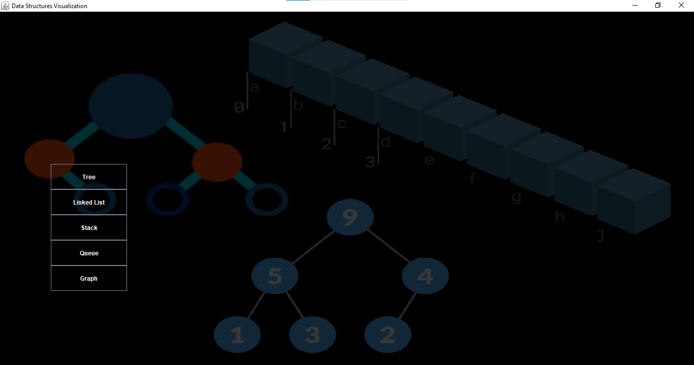

# 🧠 Data Structures Visualizer (In Progress)

This project is a desktop-based application that helps visualize core Data Structures using **Java** and **Swing**. It is designed to support students, learners, and educators in understanding how fundamental data structures work through interactive visuals and step-by-step animations.

---

## 📌 Features

- 📊 **Binary Trees**
  - Node insertion
  - traversal (animated)

- 📦 **Stacks & Queues** *(Planned)*
  - Push / Pop / Enqueue / Dequeue animations

- 🌐 **Graphs** *(Planned)*  
  - Traversal algorithms (BFS, DFS)

---

## 🎯 Project Goals

- Visual learning aid for fundamental data structures
- Strengthen understanding of DSA through coding
- Practice GUI development in **Java Swing**
- Make DSA fun and interactive for beginners

---

## 🛠️ Technologies Used

| Tool/Language | Purpose                    |
|---------------|-----------------------------|
| Java (Core)   | Data structure logic        |
| Java Swing    | GUI development             |
| AWT / 2D API  | Basic shapes & rendering    |

---

## 🚧 Current Progress

- ✅ Binary Tree insertion (visual)
- ✅ Preorder traversal (visual)
- ✅ Swing-based UI framework
- ⏳ Stack & Queue visualization (next)
- ⏳ Basic traversal animations for Graphs

---

## 📷 Screenshots

### 🏠 Home Screen with Structure Selection

### 🌲 Binary Tree Node Insertion View

---

## 👨‍💻 Status

This project is under active development as part of my learning journey in Data Structures and Java UI programming.  
Contributions, suggestions, or feedback are welcome!

---

## 📚 Learning Outcomes

- Practicing **Data Structures and Algorithms**
- Hands-on experience with **Java GUI programming**
- Applying OOP concepts in visual applications

---

## 📬 Contact

**Aziz Ullah**  
📧 azizullahkhanauk1@gmail.com  
🔗 [GitHub](https://github.com/Azizkhan-ak)  
🔗 [LinkedIn](https://www.linkedin.com/in/aziz-ullah-490631180/)

---

> ⭐ If you find this project interesting or helpful, please consider starring the repo!
